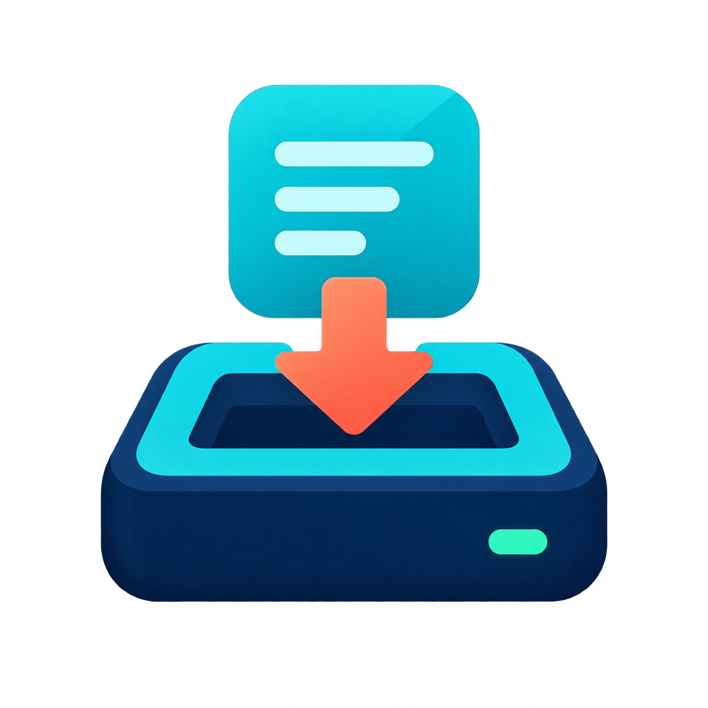

<p align="center">
  
</p>

<h1 align="center">MacBay</h1>

<p align="center">
  <a href="README.md">English</a> •
  <a href="docs/README.ko.md">한국어</a> •
  <a href="docs/README.zh.md">简体中文</a> •
  <a href="docs/README.ja.md">日本語</a>
</p>

MacBay is a developer-first storage externalizer designed for Apple Silicon Macs. It safely moves large applications, Xcode DeviceSupport data, and developer caches to an external APFS drive while transparently preserving the original paths for terminal CLIs, LaunchAgents, and the macOS Dock.

[](https://github.com/thingk0/macbay/actions/workflows/ci.yml)
[](LICENSE)
[](https://www.apple.com/macos/)
[](https://en.wikipedia.org/wiki/Apple_silicon) [](https://github.com/sponsors/thingk0)

---

## Features

- **Application Relocation (`dock` / `undock`)**: Migrate large apps to external storage and replace them with symbolic links. Dock icons and LaunchServices are automatically refreshed.
- **Safety Engine (`AppInspector`)**: Automatically checks application bundles for virtualization entitlements, kernel/system extensions, and hardcoded relocation signals.
- **Xcode DeviceSupport Management (`xcode`)**: Offload massive iOS DeviceSupport symbols while keeping Xcode functioning seamlessly. Preserves existing legacy links and cleans up unavailable simulators.
- **Developer Cache Routing (`cache`)**: Route npm, uv, Gradle, and Hugging Face caches to external storage via a clean, isolated block in `~/.zshrc`.
- **Strict Volume Validation**: Automatically validates external APFS filesystems and rejects installer DMGs, read-only drives, and internal disks.

---

## Supported Environment

- **macOS**: 13 (Ventura) or newer
- **Hardware**: Apple Silicon (M1 / M2 / M3 / M4)
- **External Storage**: Physical external SSD/HDD formatted as **APFS** (GUID Partition Map, writable)
- **Developer Tools**: Xcode Command Line Tools (`xcode-select --install`)

---

## Installation

### Method 1: Homebrew (Recommended)

Install MacBay using Homebrew:

```sh
brew install thingk0/tap/macbay
mb --help
```

Homebrew builds the binary directly from the tagged source release for Apple Silicon (macOS 13+). Both `mb` and the `macbay` alias are installed into your Homebrew `bin` directory.

#### Updating via Homebrew

```sh
brew update
brew upgrade macbay
```

#### Uninstalling via Homebrew

> [!CAUTION]
> `brew uninstall macbay` only removes the CLI executables (`mb` and `macbay`). It **does not** automatically restore relocated applications from external storage or reset `~/.zshrc` cache redirections.
>
> **Before uninstalling MacBay**, perform the following cleanup steps:
> 1. Restore any docked applications back to internal storage:
>    ```sh
>    mb undock <AppName>.app
>    ```
> 2. Reset the cache environment variables in `~/.zshrc`:
>    ```sh
>    mb cache --reset
>    ```
> 3. Now safely uninstall the formula:
>    ```sh
>    brew uninstall macbay
>    ```

---

### Method 2: Building from Source

Requirements: macOS 13 or newer, Apple Silicon, and Xcode Command Line Tools or Xcode 15.3+ (providing Swift 5.10 or newer).

```sh
# Clone the repository
git clone https://github.com/thingk0/macbay.git
cd macbay

# Build release binaries
swift build -c release

# Run tests
swift test

# Copy to /usr/local/bin (optional)
sudo cp .build/release/mb /usr/local/bin/mb
sudo ln -sf /usr/local/bin/mb /usr/local/bin/macbay
```

Verify installation:

```sh
mb --version
# Output: 1.1.0
```

---

## Quick Start

### 1. Check Storage Health

Inspect internal drive space, mounted external volumes, and any ineligible drives:

```sh
mb status
```

Output example:
```text
MacBay storage status

Internal · Macintosh HD
  /
  ████████░░░░░░░░░░░░  42.2% used
  Used: 96.3 GB / 228.3 GB
  Free: 132.0 GB

External · ExternalSSD
  /Volumes/ExternalSSD
  ████░░░░░░░░░░░░░░░░  20.5% used
  Used: 205.0 GB / 1000.0 GB
  Free: 795.0 GB

Docked items · 0
  None

Warnings · 2
  • Excluded volume 'InstallerImage' (/Volumes/InstallerImage): Disk image volumes are not supported
  • Excluded volume 'ToolInstaller' (/Volumes/ToolInstaller): Disk image volumes are not supported
```

### 2. Discover Relocation Candidates

Scan for large applications, developer caches, already externalized applications, and broken links:

```sh
mb scan
```

Output example:
```text
MacBay scan
8 apps · 2 caches · 2 external
App threshold: 200.0 MB

Applications · 8
  NAME                    SIZE  STATUS
  HeavyStudio.app       2.1 GB  Review
  VirtualMachine.app    1.8 GB  Blocked
  ContainerRuntime.app  1.2 GB  Blocked
  DeveloperIDE.app    850.0 MB  Safe
  CloudStorage.app    620.4 MB  Safe
  SystemHelper.app    410.2 MB  Review
  DriverDaemon.app    320.0 MB  Blocked
  Messenger.app       240.5 MB  Safe

  Safe: no relocation signals detected
  Review: check compatibility details before using --force
  Blocked: migration not allowed

Developer caches · 2
  CoreSimulator  191.5 MB
  npm cache      124.2 MB

Already external · 2
  DesignKit.app    1.5 GB  Unmanaged
    → /Volumes/ExternalSSD/Applications/DesignKit.app
  AudioEngine.app  1.2 GB  MacBay
    → /Volumes/ExternalSSD/MacBay/Applications/AudioEngine.app

  MacBay: recorded in volume manifest
  Unmanaged: no matching MacBay migration record
```

To see full bundle paths and detailed compatibility reasons/evidence:
```sh
mb scan --verbose
```

- **Applications**: Local apps (≥ 200 MB) with compatibility status (`Safe`, `Review`, `Blocked`).
- **Developer caches**: Large developer tool caches (e.g. CoreSimulator, npm cache).
- **Already external**: Applications already relocated to external storage:
  - `MacBay`: Recorded and managed in the external volume's `manifest.json`.
  - `Unmanaged`: Relocated manually or outside of MacBay.
  - `Unconfirmed`: Target is on external storage, but manifest reading failed.
- **Unresolved links**: Broken symlinks (`Target unavailable`), circular symlinks, or failed volume checks.

### 3. Diagnose Links and Records

Verify that application links, developer cache links, and the MacBay records on connected volumes still agree. `doctor` is read-only and never changes files:

```sh
mb doctor
```

Output example:
```text
MacBay doctor

Volumes consulted · 1
  • ExternalSSD (/Volumes/ExternalSSD) — 2 records

Needs attention · 1
  ! OfflineApp.app — Target unavailable: /Volumes/ExternalSSD/MacBay/Applications/OfflineApp.app
    Next: Reconnect the volume or confirm the path exists, then run 'mb doctor' again.

Healthy · 2
  • AudioEngine.app → /Volumes/ExternalSSD/MacBay/Applications/AudioEngine.app [MacBay]
  • LegacyTool.app → /Volumes/Backup/LegacyTool.app [unmanaged]
```

- `Healthy`: The link resolves and matches its MacBay record or the MacBay layout. Links without a record are shown as `unmanaged` information, not as problems.
- `Needs attention`: Broken links, circular links, records that disagree with the actual target path, or recorded external copies that are missing.
- `Unable to verify`: The link, the link target volume, or a volume's `manifest.json` could not be read (for example permission or manifest errors).
- `Nothing to verify` (no records or relocated links were found) is reported separately from "no problems found".

Exit codes: `0` when nothing needs attention, `1` when problems or unverifiable items were found, `2` when the check itself failed (for example an unreadable `--volume` path).

> [!NOTE]
> MacBay only reads records from connected external volumes, so a detached drive cannot be verified. Diagnostics report the scope that was actually checked and do not assume that a missing target was ejected or deleted.

---

## Commands & Usage

### Diagnosing Links and Records (`doctor`)

Inspects `/Applications` links, known developer cache links, and the MacBay records on connected external volumes (including read-only volumes). It never writes files or configuration:

```sh
# Diagnose the connected volumes and local links
mb doctor

# Inspect an additional volume that is not mounted under /Volumes
mb doctor --volume /Volumes/Archive
```

**What it checks**:
1. **Application links**: Every symlink in `/Applications` is resolved (relative, chained, and circular links included).
2. **Developer cache links**: `~/Library/Developer/Xcode/iOS DeviceSupport`, `~/Library/Developer/CoreSimulator`, `~/.npm`, `~/.cache/uv`, `~/.gradle`, and `~/.cache/huggingface`.
3. **Volume records**: Each connected volume's `MacBay/manifest.json` is compared against the real source and target paths.
4. **Recorded copies**: Records whose source is no longer a link and whose external copy is gone are reported as a mismatch between records and reality.

**Result groups**: `Healthy`, `Needs attention`, `Unable to verify`, plus `unmanaged` information for links that MacBay never created. Every problem includes a stable diagnostic code in `--json` output and a suggested next action.

**Exit codes**: `0` healthy, `1` problems or unverifiable items found, `2` the check itself failed.

> [!IMPORTANT]
> `doctor` is read-only. It does not delete, move, or repair anything, and it does not keep records on the internal drive, so a detached external volume cannot be verified until it is reconnected.

### Moving an Application (`dock`)

Moves an application bundle to the external volume and creates a symbolic link at `/Applications/<App>.app`.

```sh
# Always preview first with --dry-run
mb dock Example.app --dry-run

# Perform relocation
mb dock Example.app
```

**How it works**:
1. **Validation**: Checks bundle integrity, active processes (`lsof`), and SQLite locks (`-wal`, `-shm`).
2. **Compatibility**: Inspects code signature entitlements and relocation markers.
3. **Atomic Copy & Verify**: Copies the bundle via `ditto`, preserves metadata, and verifies with `codesign --verify --deep --strict`.
4. **Symlink Replacement**: Atomically swaps the original bundle with a symbolic link.
5. **System Refresh**: Rebuilds LaunchServices registration (`lsregister -f`) and restarts the Dock to avoid generic white icons.

> [!NOTE]
> If an application is flagged with ⚠️ **Review** (`POPUP_RISK` in JSON), pass `--force` to proceed after reviewing potential risks:
> ```sh
> mb dock HeavyStudio.app --force --dry-run
> ```

### Restoring an Application (`undock`)

Restores an externalized application back to its original location in `/Applications` and cleans up the external copy:

```sh
# Preview restore
mb undock Example.app --dry-run

# Restore to internal disk
mb undock Example.app
```

### Xcode Maintenance (`xcode`)

Externalizes `~/Library/Developer/Xcode/iOS DeviceSupport` to the external volume and cleans up unavailable iOS simulators:

```sh
# Preview Xcode externalization
mb xcode --dry-run

# Execute Xcode maintenance
mb xcode
```

> [!TIP]
> If you already have a symlink pointing to an external volume (e.g. `/Volumes/<Drive>/Developer/Xcode/iOS DeviceSupport`), MacBay recognizes and validates the link target without unnecessary relocation.

### Developer Cache Routing (`cache`)

Routes developer package caches to external storage by adding a managed, isolated configuration block to `~/.zshrc`:

```sh
# Preview cache redirection
mb cache --enable --dry-run

# Enable external cache routing
mb cache --enable

# Reset and remove managed block from ~/.zshrc
mb cache --reset
```

Managed caches include:
- `npm`: `npm_config_cache`
- `uv`: `UV_CACHE_DIR`
- `Gradle`: `GRADLE_USER_HOME`
- `Hugging Face`: `HF_HOME`

---

## External Volume Requirements & Limits

To ensure data integrity, MacBay enforces strict volume eligibility criteria:

| Requirement | Rule | Rationale |
| :--- | :--- | :--- |
| **Mount Point** | Must be mounted under `/Volumes/` | Standard macOS external volume hierarchy |
| **Drive Type** | Physical external (`Internal == false`) | Avoids externalizing back onto the primary drive |
| **Filesystem** | **APFS** (`FilesystemType == apfs`) | Requires APFS clone/symlink/metadata capabilities |
| **Permissions** | Writable (`WritableVolume == true`) | Read-only drives cannot host application bundles |
| **Protocol** | `BusProtocol != "Disk Image"` | Rejects temporary installer DMGs automatically |

- **Auto-Selection**: When exactly one eligible external volume is mounted, MacBay automatically selects it.
- **Multiple Volumes**: When two or more eligible drives are connected, `--volume <path>` (or `-v`) is required to prevent accidental writes to the wrong drive.

---

## Safety Model & Compatibility Tiers

Before migrating any bundle, `AppInspector` grades the application:

- 🟢 **Safe** (`SAFE` in JSON): Clean bundle layout with no relocation hooks or virtualization requirements. Safe for standard relocation.
- ⚠️ **Review** (`POPUP_RISK` in JSON): Application contains self-relocation checks (e.g., `moveToApplicationsFolder`, `PFMoveToApplicationsFolder` in Mach-O/ASAR) or privileged helper tools (`SMPrivilegedExecutables`). Requires the `-f, --force` flag to migrate.
- ❌ **Blocked** (`BLOCKED` in JSON): Application requires hypervisor/virtualization entitlements (`com.apple.security.virtualization`), contains Driver/System/Kernel Extensions, or has corrupted code signatures. **Migration is blocked to prevent system instability.**

---

## External Layout

When externalizing, MacBay maintains the following structure on your external drive:

```text
/Volumes/<ExternalDrive>/MacBay/
├── Applications/       # Relocated application bundles
├── Caches/             # npm, uv, Gradle, and Hugging Face caches
├── Xcode/              # iOS DeviceSupport symbol caches
└── manifest.json       # Codable metadata manifest of all docked items
```

---

## JSON Output & Automation

Every command supports the `--json` flag for integration with scripts, CI, and agent tools:

```sh
mb status --json
```

`mb doctor --json` reports `volumes`, `findings`, and `summary`. Each finding carries a stable `code` (for example `link_target_unavailable`, `link_unmanaged`, `manifest_unreadable`) with its `status` (`healthy`, `needs_attention`, `unable_to_verify`), related paths, and a recommended action.

On errors, MacBay outputs a structured error envelope to `stderr` and exits with a non-zero status:

```json
{
  "error": {
    "code": "configuration_error | retryable_error | execution_error",
    "message": "Application is blocked from migration (/Applications/VirtualMachine.app)",
    "details": "com.apple.security.virtualization=true in codesign entitlements"
  }
}
```

---

## Contributing

Contributions are welcome! Please read [CONTRIBUTING.md](CONTRIBUTING.md) for details on our code of conduct, hardware-free testing setup, and submission process.

---

## License

MacBay is open-source software licensed under the [MIT License](LICENSE). Copyright © 2026 thingk0.
