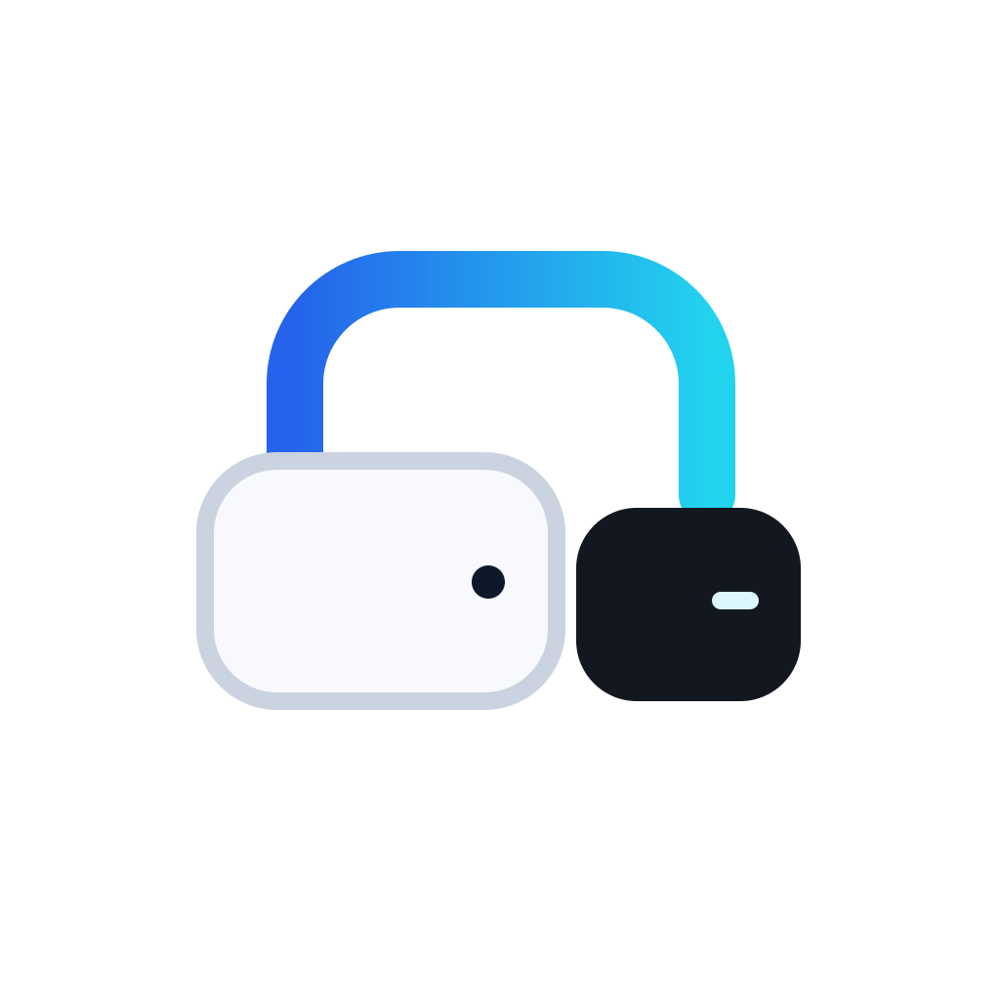

<p align="center">
  <picture>
    <source media="(prefers-color-scheme: dark)" srcset="../Assets/brand/macbay-symbol-dark.svg">
    
  </picture>
</p>

<h1 align="center">MacBay</h1>

<p align="center">
  <a href="../README.md">English</a> •
  <a href="README.ko.md">한국어</a> •
  <a href="README.zh.md">简体中文</a> •
  <a href="README.ja.md">日本語</a>
</p>

MacBay 是一款专为 Apple Silicon Mac 设计的开发者优先存储外部化工具。它能够安全地将大型应用程序、Xcode DeviceSupport 数据以及各类开发者缓存迁移至外置 APFS 驱动器，同时无缝保持终端命令行工具（CLI）、LaunchAgent 和 macOS Dock 栏原有的访问路径不变。

[](https://github.com/thingk0/macbay/actions/workflows/ci.yml)
[](../LICENSE)
[](https://www.apple.com/macos/)
[](https://en.wikipedia.org/wiki/Apple_silicon)

---

## 特性

- **交互式 TUI 模式 (`mb` / `mb tui`)**：在终端直接输入 `mb` 即可启动键盘控制的终端用户界面（TUI）。查看磁盘容量、浏览应用候选（Safe/Review/Blocked 状态）、安全进行 dry-run 预览与迁移/恢复、探索诊断结果及针对性建议。
- **应用程序迁移 (`dock` / `undock` / `adopt`)**：将大型应用迁移至外置存储、恢复至内置磁盘，或在无需拷回内置磁盘的情况下将已有外置应用纳管至 MacBay 标准目录结构。自动刷新 Dock 栏图标与 LaunchServices 注册。
- **安全检查引擎 (`AppInspector`)**：自动分析应用程序包（App Bundle）的虚拟化权限（Entitlements）、内核/系统扩展（KEXT/System Extensions）以及硬编码重定位信号。
- **Xcode DeviceSupport 管理 (`xcode`)**：迁移庞大的 iOS DeviceSupport 符号文件，同时确保 Xcode 无缝正常运行。保留原有的历史链接，并清理不可用的模拟器。
- **任意目录迁移 (`move` / `unmove`)**：将任意目录——游戏库、虚拟机磁盘、数据集、媒体文件夹——迁移至 `<Volume>/MacBay/`，并采用与应用相同的清单跟踪符号链接模型进行管理。
- **开发者缓存重定向 (`cache`)**：通过在 `~/.zshrc` 中注入清晰、隔离的配置块，将 npm、pnpm、Yarn、bun、uv、pip、Gradle、CocoaPods、Go 模块、Android 用户数据、Homebrew 下载以及 Hugging Face 的缓存路由至外置存储。
- **自清理 (`teardown`)**：在卸载之前，用一条命令恢复所有受管应用与目录、移除托管缓存链接与 `~/.zshrc` 配置块，并忘记默认卷。
- **严格的外置卷验证**：自动校验外置 APFS 文件系统，拒绝安装器 DMG、只读驱动器及内置磁盘。

---

## 支持环境

- **macOS**：13 (Ventura) 或更高版本
- **硬件架构**：Apple Silicon (M1 / M2 / M3 / M4)
- **外置存储**：格式化为 **APFS** 的物理外置固态硬盘/机械硬盘（GUID 分区图，支持写入）
- **开发工具**：Xcode 命令行工具（Command Line Tools，`xcode-select --install`）

---

## 安装方式

### 方式 1：Homebrew（推荐）

使用 Homebrew 安装 MacBay：

```sh
brew install thingk0/tap/macbay
mb --help
```

Homebrew 将直接基于带有标签（Tag）的源码版本针对 Apple Silicon（macOS 13+）编译二进制文件。`mb` 命令及其别名 `macbay` 均会被安装到 Homebrew 的 `bin` 目录下。

#### 通过 Homebrew 更新

```sh
brew update
brew upgrade macbay
```

#### 通过 Homebrew 卸载

> [!CAUTION]
> `brew uninstall macbay` 仅会删除 CLI 可执行文件（`mb` 和 `macbay`）。它**不会**自动从外置存储中恢复已迁移的应用程序，也不会重置 `~/.zshrc` 中的缓存重定向配置。
>
> **在卸载 MacBay 之前**，用一条命令恢复其管理的所有内容：
> 1. 运行 teardown（先用 `--dry-run` 预览）：
>    ```sh
>    mb teardown --dry-run
>    mb teardown
>    ```
>    该命令会恢复已 dock 的应用与已 move 的目录、移除托管缓存链接、清除 `~/.zshrc` 配置块，并忘记默认卷。
> 2. 随后即可安全卸载 Formula：
>    ```sh
>    brew uninstall macbay
>    ```
>
> 如需手动清理，可对每个已 dock 应用执行 `mb undock <AppName>.app`，对每个已迁移目录执行 `mb unmove <path>`，并运行 `mb cache --reset`。

---

### 方式 2：源码构建

环境要求：macOS 13 或更高版本、Apple Silicon 芯片，以及 Xcode 命令行工具或 Xcode 15.3+（提供 Swift 5.10 或更高版本）。

```sh
# 克隆仓库
git clone https://github.com/thingk0/macbay.git
cd macbay

# 构建 Release 二进制文件
swift build -c release

# 运行测试
swift test

# 复制到 /usr/local/bin（可选）
sudo cp .build/release/mb /usr/local/bin/mb
sudo ln -sf /usr/local/bin/mb /usr/local/bin/macbay
```

验证安装：

```sh
mb --version
# 输出：1.2.1
```

---

## 快速入门

### 0. 交互式 TUI 模式（默认启动）

在终端中无参数直接运行 `mb` 即可启动键盘控制的 TUI：

```sh
mb
# 或显式启动：
mb tui
```

> [!NOTE]
> 在非交互式环境（CI、脚本、管道）或不支持的 `TERM` 终端中，`mb` 会在 stdout 输出标准 CLI 帮助并退出。在非交互式环境中直接运行 `mb tui` 会输出错误说明并以非零状态码退出。

#### 键盘快捷键

| 按键 | 功能 |
| --- | --- |
| `↑` / `↓` 或 `j` / `k` | 浏览菜单与列表 |
| `Enter` | 选择菜单或确认操作 |
| `Esc` | 返回上一级界面 |
| `q` | 退出 MacBay TUI |
| `r` | 刷新当前界面数据 |
| `←` / `→` 或 `Tab` | 切换对话框按钮（Cancel / Confirm） |

#### TUI 覆盖范围

- **首页**：查看内置与外置 APFS 磁盘容量，以及当前由 MacBay 纳管的应用数量。
- **迁移应用 (`dock`)**：按大小排序浏览应用候选列表，查看 `[Safe]`、`[Review]` 与 `[Blocked]` 兼容性状态。查看详细路径与兼容性技术依据，选择当前会话目标卷，查看包含空间预估的 dry-run 预览并在确认后执行迁移。（Review 应用需确认并接受风险后使用 `--force` 安全迁移）
- **恢复应用 (`undock`)**：将已连接外置卷上的 MacBay 纳管应用安全恢复至内置 `/Applications`。非纳管应用可直接在此界面完成纳管：确认当前位置、标准存储路径、链接变更以及是否会移动文件后执行，随后才会准备恢复预览。纳管始终使用应用实际所在的卷，不会擅自改用已配置的默认卷。未确认链接及损坏链接会显示对应状态与 `mb doctor` 指引。
- **系统诊断 (`doctor`)**：检查外置应用与开发者数据的链接断裂、目标缺失、记录不一致与中断的操作，并查看针对每项问题的修复建议。
- **搜索与筛选**：在移动／恢复列表中按 `/` 搜索应用名称，Enter应用，Esc清空搜索。`f` 筛选通过兼容性检查的应用／已管理应用，`s` 切换名称与大小排序，`c` 清空搜索和筛选。
- **复制进度**：根据目标文件大小估算复制容量、比例和平均增长速度。预分配可能领先实际传输，因此这不是已验证的传输量或磁盘吞吐量。复制阶段不显示100%，签名验证是独立阶段。无法采样时显示当前阶段与耗时。
- **从诊断进入恢复**：重复应用问题中按 `p` 比较副本并预览重新外置或保留本地副本。中断的repair可按 `b` 查看匹配的日志及回滚计划。修改前须单独确认，默认选择取消；风险应用须明确接受风险。`r` 重新诊断。中断的adopt不会使用repair回滚。
- 多选和Xcode／缓存的TUI操作仍在计划中，目前请使用CLI。

### 1. 检查存储状态

查看内置磁盘剩余空间、已挂载的外置卷以及所有不合规的驱动器：

```sh
mb status
```

输出示例：
```text
MacBay storage status

Internal · Macintosh HD
  /
  ████████░░░░░░░░░░░░  42.2% used
  Used: 96.3 GB / 228.3 GB
  Free: 132.0 GB

External · ExternalSSD
  /Volumes/ExternalSSD
  ████░░░░░░░░░░░░░░░░  20.5% used
  Used: 205.0 GB / 1000.0 GB
  Free: 795.0 GB

Docked items · 0
  None

Warnings · 2
  • Excluded volume 'InstallerImage' (/Volumes/InstallerImage): Disk image volumes are not supported
  • Excluded volume 'ToolInstaller' (/Volumes/ToolInstaller): Disk image volumes are not supported
```

### 2. 发现可迁移目标

扫描大型应用程序、开发者缓存、已外部化应用程序以及断开的符号链接：

```sh
mb scan
```

输出示例：
```text
MacBay scan
8 apps · 2 caches · 2 external
App threshold: 200.0 MB

Applications · 8
  NAME                    SIZE  STATUS
  HeavyStudio.app       2.1 GB  Review
  VirtualMachine.app    1.8 GB  Blocked
  ContainerRuntime.app  1.2 GB  Blocked
  DeveloperIDE.app    850.0 MB  Safe
  CloudStorage.app    620.4 MB  Safe
  SystemHelper.app    410.2 MB  Review
  DriverDaemon.app    320.0 MB  Blocked
  Messenger.app       240.5 MB  Safe

  Safe: no relocation signals detected
  Review: check compatibility details before using --force
  Blocked: migration not allowed

Developer caches · 2
  CoreSimulator  191.5 MB
  npm cache      124.2 MB

Already external · 2
  DesignKit.app    1.5 GB  Unmanaged
    → /Volumes/ExternalSSD/Applications/DesignKit.app
  AudioEngine.app  1.2 GB  MacBay
    → /Volumes/ExternalSSD/MacBay/Applications/AudioEngine.app

  MacBay: recorded in volume manifest
  Unmanaged: no matching MacBay migration record
```

若需查看完整应用路径及详细兼容性评估原因与证据：
```sh
mb scan --verbose
```

- **候选应用 (Applications)**: 位于内置磁盘的大型应用（≥ 200 MB）及兼容性等级（`Safe`、`Review`、`Blocked`）。
- **开发者缓存 (Developer caches)**: 大型开发工具缓存（如 CoreSimulator、npm cache）。
- **已外部化应用 (Already external)**: 已重定向至外置存储的应用程序：
  - `MacBay`: 已登记在外置卷的 `manifest.json` 中并由 MacBay 管理。
  - `Unmanaged`: 手动迁移或通过其他工具迁移、MacBay 中无记录的应用。
  - `Unconfirmed`: 目标位于外置卷，但读取清单文件时出错。
- **未解析链接 (Unresolved links)**: 目标不存在（`Target unavailable`）、循环链接或卷检查失败等异常链接。

### 3. 链接与记录诊断

检查应用程序链接、开发者缓存链接，以及已连接卷中的 MacBay 记录是否与实际情况一致。`doctor` 为只读命令，不会修改任何文件：

```sh
mb doctor
```

输出示例：
```text
MacBay doctor

Volumes consulted · 1
  • ExternalSSD (/Volumes/ExternalSSD) — 2 records

Needs attention · 1
  ! OfflineApp.app — Target unavailable: /Volumes/ExternalSSD/MacBay/Applications/OfflineApp.app
    Next: Reconnect the volume or confirm the path exists, then run 'mb doctor' again.

Healthy · 2
  • AudioEngine.app → /Volumes/ExternalSSD/MacBay/Applications/AudioEngine.app [MacBay]
  • LegacyTool.app → /Volumes/Backup/LegacyTool.app [unmanaged]
```

- `Healthy`：链接可正常解析，且与 MacBay 记录或既有目录结构一致。无记录的链接会作为 `unmanaged` 信息展示，而非问题。
- `Needs attention`：链接断开、循环链接、实际目标与记录路径不一致、记录的外置副本或源路径丢失，以及在原本应为链接的位置出现了普通文件或目录。
- `Unable to verify`：无法读取链接、链接所在卷或该卷的 `manifest.json`（例如权限错误或清单文件损坏）。
- `Notes`：说明检查范围，包括手动迁移的条目没有 MacBay 历史记录因而不会被评估，以及记录无法读取的卷中的条目未被检查。
- `Nothing to verify`（没有可检查的记录或链接）会与“未发现问题”分开报告。

退出码：无异常 `0`，发现问题或存在无法验证项 `1`，诊断本身执行失败（例如 `--volume` 路径无法检查）`2`。

> [!NOTE]
> MacBay 只读取已连接外置卷中的记录，因此无法验证已断开的驱动器。诊断只报告实际检查到的范围，不会假设目标丢失是由于磁盘拔出或数据删除。

---

## 命令与用法

### 命令别名

简写支持与完整命令相同的参数和选项。运行 `mb --help` 可查看别名。

| Command | Alias |
| --- | --- |
| `init` | `i` |
| `status` | `st` |
| `scan` | `sc` |
| `doctor` | `doc` |
| `references` | `refs` |
| `dock` | `dk` |
| `adopt` | `ad` |
| `undock` | `ud` |
| `repair` | `rep` |
| `xcode` | `xc` |
| `move` | `mv` |
| `unmove` | `umv` |
| `cache` | `c` |
| `teardown` | `td` |
| `tui` | `ui` |

```sh
mb st
mb sc --json
mb doc
mb dk --help
```

### 选择默认卷 (`init`)

保存省略 `--volume` 时变更类命令所使用的默认外置卷，使 `dock`、`undock`、`adopt`、`xcode` 与 `cache` 始终作用于同一块驱动器：

```sh
# 仅有一个符合条件的卷时直接保存，在终端中则通过编号列表选择
mb init

# 无需确认，直接将指定卷保存为默认值
mb init --volume /Volumes/ExternalSSD

# 打印已保存的默认卷
mb init --show

# 删除已保存的默认卷
mb init --reset
```

默认卷会连同卷 UUID 一起写入 `$XDG_CONFIG_HOME/macbay/config.json`（或 `~/.config/macbay/config.json`），因此即使驱动器以其他名称挂载也能被识别。若已保存的卷未连接，变更类命令会直接中止，而不会静默写入其他驱动器；`mb status` 与 `mb doctor` 会报告该状态，再次运行 `mb init` 可在确认后替换默认卷。

### 链接与记录诊断 (`doctor`)

检查 `/Applications` 中的链接、已知的开发者缓存链接，以及已连接外置卷（含只读卷）中的 MacBay 记录。该命令不会修改任何文件或配置：

```sh
# 诊断已连接的卷与本地链接
mb doctor

# 额外检查未挂载在 /Volumes 下的卷
mb doctor --volume /Volumes/Archive
```

**检查内容**：
1. **应用程序链接**：解析 `/Applications` 中的所有符号链接（包括相对链接、链式链接与循环链接）。
2. **开发者缓存链接**：`~/Library/Developer/Xcode/iOS DeviceSupport`、`~/Library/Developer/CoreSimulator`、`~/.npm`、`~/.cache/uv`、`~/.gradle` 与 `~/.cache/huggingface`。
3. **卷记录**：将已连接卷的 `MacBay/manifest.json` 与实际源路径和目标路径进行比对。
4. **本地数据**：记录中的源路径不再是链接、而是以普通文件或目录形式存在时，会报告为 `Local data detected`，并显示两个路径及其当前大小。若外置副本也已丢失，则不会归类为简单重复，而是报告记录与实际状态不一致。
5. **中断的操作**：报告卷上残留的未完成 `adopt`/`repair` 操作，并给出回滚或继续所需的命令。

> [!NOTE]
> `doctor` 不会删除、覆盖或重新迁移任何内容，也不会断言本地数据是“因更新而重新生成”或“两份副本完全相同”。手动迁移的条目没有 MacBay 历史记录，因此不参与本地数据检查；该范围会在 `notes` 中说明。

**结果分组**：`Healthy`、`Needs attention`、`Unable to verify`，以及针对非 MacBay 创建的链接的 `unmanaged` 信息。所有问题在 `--json` 输出中都会附带稳定的诊断代码与建议操作。

**退出码**：健康 `0`，发现问题或存在无法验证项 `1`，诊断本身失败 `2`。

> [!IMPORTANT]
> `doctor` 为只读命令：它不会删除、移动或修复任何内容，也不会在内置磁盘中保存额外记录，因此断开的外置卷在重新连接之前无法被验证。

### 检查保存的应用路径 (`references`)

检查特定配置文件中保存的应用路径。仅读取 `--path` 指定的文件，不扫描磁盘上的其他位置：

```sh
# 检查单个文件
mb references --path ~/.cursor/mcp.json

# 检查多个文件（可重复）
mb references --path ~/.cursor/mcp.json --path ~/Library/LaunchAgents/com.example.tool.plist
```

JSON 与 XML/二进制 plist 通过 Foundation 读取；TOML、YAML、INI、shell 等文本文件会提取跨越 `.app` 边界的绝对路径。相对路径基于当前目录，`~` 基于主目录；重复指定的路径只检查一次。为确认保存路径是否存在并寻找替代候选，会查询 `/Applications` 与 `~/Applications`，不执行卷或清单检查。

当保存的路径不存在时，会在 `/Applications` 与 `~/Applications` 中查找唯一的同名应用（若解析为同一实际应用则优先 `/Applications`）。若相同内部路径存在，则报告 `external_reference_stale_candidate` 及当前候选项；若没有对应应用或内部文件，则报告 `external_reference_missing`。访问错误、循环链接与同名应用歧义为 `external_reference_unverified`；读取上限为 `external_reference_scan_incomplete`。

> [!NOTE]
> 引用检查为只读。对类似路径的字符串做启发式提取属于支持范围；MacBay 不会展开 shell 变量或执行脚本，也不会仅因配置存在就断言它正在使用。已知的 MCP 区域（TOML 中的 `mcp_servers`、JSON 中的 `mcpServers`）会跳过显式禁用的服务器，不支持的 TOML 结构会报告为部分检查。报告的路径只是候选项，MacBay 不会断言应用已移动或删除、两个副本版本相同，也不会断言该设置当前正在使用。路径通配符、`<AppName>` 这类模板标记以及字面的 `AppName.app` 占位符不会作为文件引用检查，命中该跳过策略的条目会从 findings 中排除并在 `notes` 中说明。外置卷未连接仅作为可能原因提示。若保存路径疑似有误，请先确认该设置当前正在使用，再备份文件并修正路径（例如改为 `/Applications/<App>.app/...`）。MacBay 不会修改这些文件。

> [!NOTE]
> 上限为 10,000 个配置文件、每文件 2 MiB、总读取 64 MiB。备份文件会被跳过。

**退出码**：保存路径全部正常为 `0`，存在缺失路径、读取失败或读取不完整为 `1`，参数无效或检查本身失败为 `2`。

### 迁移应用程序 (`dock`)

将应用程序包迁移到外置卷，并在 `/Applications/<App>.app` 创建指向该卷的符号链接。

```sh
# 建议先使用 --dry-run 进行演练预览
mb dock Example.app --dry-run

# 执行迁移
mb dock Example.app
```

预览输出示例：
```text
Dry run: dock Example.app
  Size: 21.6 GB
  Source: /Applications/Example.app
  Destination: /Volumes/ExternalSSD/MacBay/Applications/Example.app
  Space: destination free 859.5 GB on /Volumes/ExternalSSD
  Space: estimated free after copy 837.9 GB
  Space: estimated internal space freed 21.6 GB (logical size estimate; APFS shared blocks and snapshots can change the actual amount)
  Dry run: no files were changed
```

预览还会显示目标卷的剩余空间、复制后的预计剩余空间、预计可在内置磁盘释放的空间，以及目标空间不足时的缺口容量。这些数值基于逻辑文件大小的保守估算，APFS 共享块与快照可能使实际释放量有所不同。实际执行时会重新检查剩余空间，若空间不足或无法确认，将在复制前中止；空间充足仅表示估算通过，并不保证迁移一定成功。

**工作流程**：
1. **预检验证**：检查应用程序包完整性、活跃进程（`lsof`）和 SQLite 锁（`-wal`、`-shm`）。
2. **兼容性检查**：分析代码签名授权（Entitlements）和重定位特征标记。
3. **原子拷贝与校验**：通过 `ditto` 拷贝应用包，保留全部元数据，并通过 `codesign --verify --deep --strict` 进行深度校验。
4. **符号链接替换**：以原子操作将原始应用包替换为符号链接。
5. **系统刷新**：重建 LaunchServices 注册数据库（`lsregister -f`）并重启 Dock，防止应用图标变为通用的白色占位图标。

> [!NOTE]
> 如果应用程序被标记为 ⚠️ **Review**（JSON 中的 `POPUP_RISK`），在评估潜在风险后可传入 `--force` 参数强制继续：
> ```sh
> mb dock HeavyStudio.app --force --dry-run
> ```

> [!TIP]
> 若 `/Applications` 下的应用程序已是指向 MacBay 外部外置存储的符号链接，`mb dock` 会检测到并提示改用 `mb adopt` 命令。

### 恢复应用程序 (`undock`)

将已外置的应用程序恢复到 `/Applications` 下的原始位置，并清理外置磁盘上的副本：

```sh
# 预览恢复操作
mb undock Example.app --dry-run

# 恢复至内置磁盘
mb undock Example.app
```

恢复时同样会预览空间需求：内置卷的剩余空间、复制后的预计剩余空间以及缺口容量。实际执行时会重新检查内置卷，若空间不足或无法确认，将在复制前中止。

### 纳管外置应用程序 (`adopt`)

在无需将应用程序拷回内置磁盘的情况下，将已位于外置存储的应用程序纳管至 MacBay 标准目录结构（`<Volume>/MacBay/Applications/<App>.app`），更新 `/Applications/<App>.app` 符号链接，并在 `manifest.json` 中正式登记：

```sh
# 建议先使用 --dry-run 预览
mb adopt ChatGPT.app --volume /Volumes/ExternalSSD --dry-run

# 执行纳管
mb adopt ChatGPT.app --volume /Volumes/ExternalSSD
```

预览输出示例：
```text
Dry run: adopt ChatGPT.app
  Size: 120.5 MB
  Source: /Volumes/ExternalSSD/Applications/ChatGPT.app
  Destination: /Volumes/ExternalSSD/MacBay/Applications/ChatGPT.app
  Symlink: /Applications/ChatGPT.app -> /Volumes/ExternalSSD/MacBay/Applications/ChatGPT.app
  Space: no additional space required (same volume relocation)
  Dry run: no files were changed
```

**工作流程**：
1. **目标定位**：解析 `/Applications/<App>.app` 符号链接，在外置 APFS 卷上定位源应用包。
2. **安全与兼容性检查**：检查活跃进程（`lsof`）、SQLite 锁（`-wal`、`-shm`）、代码签名完整性以及迁移阻断条件。标记为 ⚠️ **Review**（`POPUP_RISK`）的应用需要 `--force`。
3. **日志与崩溃恢复**：在外置卷上写入操作日志（`.operations/adopt-<id>.json`）。若中断，`mb doctor` 将报告未完成的操作（`incomplete_operation`）。
4. **原子重定位**：在同一 APFS 卷内将应用包原子移动至标准路径（若已在标准路径则跳过移动）。
5. **原子符号链接更新**：以原子操作将 `/Applications/<App>.app` 符号链接更新为指向新的标准路径。
6. **清单登记**：在跨进程文件锁（`flock`）保护下更新 `MacBay/manifest.json`。
7. **系统刷新**：重建 LaunchServices 注册信息并重启 Dock。

### 重复应用比对与修复 (`repair`)

当 `mb doctor` 检测到清单中已记录的应用在内置路径（`/Applications`）中再次出现完整应用包（例如由安装程序或自动更新重新生成），同时外置副本依然存在时（`local_data_detected`），`mb repair` 提供安全检查、比对以及修复流程：

```sh
# 1. 只读并排比对（版本、构建号、标识符、代码签名、体积）
mb repair "Kiro CLI.app"

# 2. 重新外置应用（redock）预览
mb repair "Kiro CLI.app" --action redock --dry-run

# 3. 保留本地应用并解除管理（keep-local）预览
mb repair "Kiro CLI.app" --action keep-local --dry-run

# 4. 实际执行
mb repair "Kiro CLI.app" --action redock
mb repair "Kiro CLI.app" --action keep-local

# 5. 回滚中断的修复操作
mb repair "Kiro CLI.app" --rollback
```

**比对输出示例**：
```text
Repair comparison · Kiro CLI.app
  Volume: /Volumes/ExternalSSD

Attributes               Local (/Applications)               External (MacBay)
───────────────────────  ──────────────────────────────────  ──────────────────────────────────
Identifier               com.kiro.cli                        com.kiro.cli
Version                  1.2.0                               1.1.0
Build                    120                                 110
Size                     105.4 MB                            98.2 MB
Signature                Valid                               Valid
Compatibility            Safe                                Safe

Available actions:
  • mb repair "Kiro CLI.app" --action redock
    Re-dock local app to external storage; backs up existing external copy
  • mb repair "Kiro CLI.app" --action keep-local
    Keep local app and remove migration record; external copy remains as unmanaged archive
```

**安全性与备份策略**：
- **标识符严格匹配**：执行 `redock` 时，会严格比对两端应用包标识符（`CFBundleIdentifier`）。若标识符不一致将拒绝执行，防止意外覆盖不相关的应用。
- **保留外置备份副本**：执行 `redock` 时，现有外置副本会首先安全移动至 `<Volume>/MacBay/Backups/<OperationID>/<App>.app` 进行归档，然后再放置新副本。外置备份副本绝不会被自动删除。
- **独立修复操作日志**：修复操作状态保存在外置卷的 `<Volume>/MacBay/.operations/repair-<App>.json`（架构版本 v1）中。若操作意外中断，`mb doctor` 将检测并报告未完成操作（`incomplete_operation`），并引导用户执行 `mb repair "<App>" --rollback` 进行恢复。
- **保留本地副本（keep-local）**：`keep-local` 仅原子移除清单中的对应条目。内置应用与外置副本均完好保留在文件系统中，外置副本变为未受管的归档副本。

### 任意目录迁移 (`move` / `unmove`)

将任意目录——游戏库、虚拟机磁盘、数据集、媒体文件夹——迁移到外置卷的 `<Volume>/MacBay/Data/<name>`，并在原位置留下符号链接。该项会以 `directory` 类型记录到 `manifest.json` 中，`mb status`、`mb doctor`、`mb teardown` 都能识别：

```sh
# 预览迁移
mb move ~/Games --dry-run

# 迁移任意目录
mb move ~/Games

# 恢复到内部存储（预览/执行）
mb unmove ~/Games --dry-run
mb unmove ~/Games
```

**工作原理**：
1. **校验**：拒绝符号链接、非目录、`.app` 包（请用 `mb dock`）、受保护的系统位置（`/System`、`/Library`、`/usr`、`/Applications`、`/Volumes`、家目录根、`~/Library` 等）、已在非内置卷上的源，以及 `mb cache` 已管理的路径。在 `~/Library` 内，`Containers`、`Group Containers`、`Mobile Documents`、`Keychains`、`Mail`、`Preferences`、`Developer` 等共享/系统子树不可迁移，`~/.ssh`、`~/.gnupg`、`~/.cargo`、`~/.rustup` 等凭据目录同样禁止。`Application Support` 与 `Caches` 根目录被阻止，但其子目录仍可迁移（例如 `~/Library/Application Support/Steam`）。
2. **安全检查**：检查活跃进程（`lsof`）与 SQLite 锁，测量目录大小，并预估外置剩余空间。
3. **复制与链接**：通过 `ditto` 带进度采样复制，然后将源原子替换为符号链接。
4. **清单**：在 `<Volume>/MacBay/manifest.json` 中记录迁移，后续可由 `mb unmove` 或 `mb teardown` 恢复。

`unmove` 会解析符号链接、把外置副本拷回、删除链接与外置副本，并移除清单记录。有记录的项经清单恢复；无记录但指向 MacBay 存储的链接仅在其位于标准 `MacBay/Data/` 布局下时才恢复，指向其他位置的链接一律拒绝。

> [!NOTE]
> `mb move` 不像 `mb dock` 那样知道应用迁移后如何保持可用——没有签名验证、LaunchServices 刷新或 Dock 重启。`.app` 包请优先使用 `dock`。

### Xcode 维护管理 (`xcode`)

将 `~/Library/Developer/Xcode/iOS DeviceSupport` 外置到外部卷，并清理不可用的 iOS 模拟器：

```sh
# 预览 Xcode 外置操作
mb xcode --dry-run

# 执行 Xcode 维护操作
mb xcode
```

> [!TIP]
> 如果您已经存在指向外置卷的符号链接（例如 `/Volumes/<Drive>/Developer/Xcode/iOS DeviceSupport`），MacBay 会自动识别并验证该链接目标，避免进行不必要的重复迁移。

### 开发者缓存重定向 (`cache`)

通过在 `~/.zshrc` 中添加托管且隔离的配置块，将开发者包管理缓存重定向至外置存储：

```sh
# 预览缓存重定向
mb cache --enable --dry-run

# 启用外置缓存重定向
mb cache --enable

# 重置并从 ~/.zshrc 中移除托管配置块
mb cache --reset
```

支持托管的缓存包括：
- `npm`：`npm_config_cache`
- `pnpm store`：`npm_config_store_dir`
- `Yarn 缓存`：`YARN_CACHE_FOLDER` —— Yarn v1 和 Berry 都遵循此变量，一个 export 即可同时路由两者
- `bun 缓存`：`BUN_INSTALL_CACHE_DIR`
- `uv`：`UV_CACHE_DIR`
- `pip`：`PIP_CACHE_DIR`
- `Gradle`：`GRADLE_USER_HOME`
- `CocoaPods`：`CP_HOME_DIR`
- `Go 模块`：`GOMODCACHE`
- `Android 用户数据`：`ANDROID_USER_HOME`
- `Homebrew 下载`：`HOMEBREW_CACHE`
- `Hugging Face`：`HF_HOME`

> [!NOTE]
> 有意不路由 Cargo（`~/.cargo`）：`CARGO_HOME` 同时包含 `~/.cargo/bin` 中的 rustup 垫片，迁移它会导致驱动器断开时 `cargo`/`rustup` 失效。如需迁移某个大型项目目录，请改用 `mb move`。

### 一键清理（`teardown`）

一次性还原 MacBay 管理的所有内容——适用于卸载前或更换外置驱动器时：

```sh
# 预览完整 teardown
mb teardown --dry-run

# 恢复所有受管项并重置配置
mb teardown

# 仅针对单个卷
mb teardown --volume /Volumes/ExternalSSD
```

**执行内容**：
1. **恢复记录项**：对每个已连接的合格卷（或 `--volume`），恢复全部清单记录——应用经 `undock`，目录经 `unmove` 路径。
2. **清理已知链接**：仍是指向 MacBay 存储但无清单记录的开发者位置（Xcode 目标、缓存目标）将被清理：指向 `MacBay/Caches/` 的链接被移除并重建为空目录（外置副本保留为非管理存档），指向其他 `MacBay/` 根目录的链接则完整恢复回内置盘。
3. **重置配置**：仅在无失败的 *完整* teardown（省略 `--volume`）时，移除 `~/.zshrc` 托管配置块并忘记已保存的默认卷。默认卷仅在确实属于本次 teardown 范围时才被遗忘——未挂载的卷会保留并附注说明，以便日后重新访问其数据。指向本次范围外卷上 MacBay 目录的缓存链接会报告为已跳过，而不是静默忽略。
4. **报告**：单项失败不会中断执行而是被汇总；存在失败时退出码为 `1`。各卷上的 `MacBay/` 目录本身予以保留——备份与未记录数据绝不删除——报告会在 notes 中提示残留目录。

> [!IMPORTANT]
> `teardown` 会把数据拷回内置磁盘。内置空间不足时对应项会报错中止，请先运行 `mb teardown --dry-run` 查看将要执行的操作。

---

## 外置卷要求与限制

为确保数据完整性与系统稳定性，MacBay 对外置卷实施了严格的准入标准：

| 要求项 | 规则 | 原理与说明 |
| :--- | :--- | :--- |
| **挂载点** | 必须挂载在 `/Volumes/` 目录下 | 标准 macOS 外置卷层级结构 |
| **驱动器类型** | 物理外置设备 (`Internal == false`) | 避免误迁移回系统主磁盘 |
| **文件系统** | **APFS** (`FilesystemType == apfs`) | 依赖 APFS 克隆、符号链接与元数据扩展能力 |
| **权限** | 支持写入 (`WritableVolume == true`) | 只读驱动器无法承载应用程序包 |
| **总线协议** | `BusProtocol != "Disk Image"` | 自动拒绝临时安装器 DMG 磁盘映像 |

- **选择优先级**：`--volume`（或 `-v`）优先，其次是 `mb init` 保存的默认卷，最后才是自动检测。
- **自动选择**：当仅挂载了一个符合条件的外置卷时，MacBay 会自动选择该卷。
- **多卷环境**：当连接了两个或更多符合条件的驱动器时，必须使用 `--volume <path>`（或 `-v`）显式指定目标卷，以防止误写入其他驱动器。通过 `mb init` 保存默认卷后，无需在每条命令中重复指定。
- **已保存的默认卷**：`mb init` 会将一个符合条件的卷保存到 `~/.config/macbay/config.json`（遵循 `$XDG_CONFIG_HOME`），且在默认卷不可用时不会静默切换到其他驱动器。

---

## 安全模型与兼容性分级

在迁移任何应用包之前，`AppInspector` 都会对该应用程序进行等级评估：

- 🟢 **Safe**（JSON 中的 `SAFE`）：应用包结构规范，无自我重定位钩子或虚拟化依赖。可安全进行常规迁移。
- ⚠️ **Review**（JSON 中的 `POPUP_RISK`）：应用程序包含自我重定位检测（例如在 Mach-O/ASAR 中调用 `moveToApplicationsFolder`、`PFMoveToApplicationsFolder`）或特权辅助工具（`SMPrivilegedExecutables`）。需要传入 `-f, --force` 参数才可迁移。
- ❌ **Blocked**（JSON 中的 `BLOCKED`）：应用程序需要虚拟化/虚拟机管理权限（`com.apple.security.virtualization`）、包含驱动程序/系统/内核扩展（Driver/System/Kernel Extensions），或代码签名损坏。**禁止迁移此类应用，以防引发系统不稳定。**

---

## 外置目录结构

执行外部化操作时，MacBay 会在外置驱动器中维护以下规范的目录结构：

```text
/Volumes/<ExternalDrive>/MacBay/
├── Applications/       # 已迁移的应用程序包
├── Caches/             # npm、uv、Gradle 等开发者缓存
├── Data/               # 通过 `mb move` 迁移的目录
├── Xcode/              # iOS DeviceSupport 符号缓存
└── manifest.json       # 记录所有已外置项元数据的 Codable 清单文件
```

---

## JSON 输出与自动化

所有命令均支持 `--json` 参数，便于与自动化脚本、CI/CD 流程及智能体（Agent）工具深度集成：

```sh
mb status --json
```

`mb doctor --json` 会输出 `volumes`、`findings`、`summary`、`warnings` 与 `notes`。每个条目都带有稳定的 `code`（例如 `link_target_unavailable`、`link_unmanaged`、`local_data_detected`、`record_source_missing`、`manifest_unreadable`）、`status`（`healthy`、`needs_attention`、`unable_to_verify`）、相关路径、适用时的大小以及建议操作。

`mb references --json` 会输出 `generatedAt`、`findings` 与 `notes`。每个条目都带有稳定的 `code`（例如 `external_reference_stale_candidate`、`external_reference_missing`、`external_reference_unverified`、`external_reference_scan_incomplete`、`external_config_unreadable`、`external_config_partially_checked`）、`status`、来源文件、保存路径、已确认的候选项（如有）、可选的 `referenceLocations` 以及建议操作。

当发生错误时，MacBay 会向 `stderr` 输出结构化的错误信封（Envelope）并以非零状态码退出：

```json
{
  "error": {
    "code": "configuration_error | retryable_error | execution_error",
    "message": "Application is blocked from migration (/Applications/VirtualMachine.app)",
    "details": "com.apple.security.virtualization=true in codesign entitlements"
  }
}
```

---

## 参与贡献

欢迎社区贡献！请参阅 [CONTRIBUTING.md](../CONTRIBUTING.md) 了解我们的行为准则、无需物理硬件的测试方案以及 Pull Request 提交规范。

---

## 开源许可证

MacBay 遵循 [MIT 许可证](../LICENSE) 开源。Copyright © 2026 thingk0。
